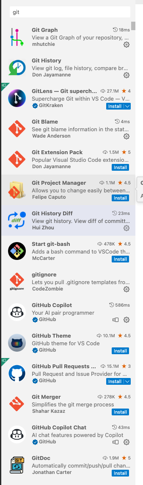

# General Machine Learning Resources

## Getting started

- [Kaggle](https://www.kaggle.com/)
- [Kubeflow](https://www.kubeflow.org/) and [Quickstart](https://www.kubeflow.org/docs/components/notebooks/quickstart-guide/)
- [How to install Python and Jupyter notebook on MacBook pro](https://bgiri-gcloud.medium.com/how-to-install-python-and-jupyter-notebook-on-macbook-pro-405904c73b9e)
- [Top 15 YouTube Channels to Level Up Your Machine Learning Skills ](https://www.kdnuggets.com/2023/03/top-15-youtube-channels-level-machine-learning-skills.html)
- [10 Best Free Machine Learning Courses for Beginners to Join in 2023](https://medium.com/javarevisited/10-free-machine-learning-courses-for-beginners-181f83b4c816)
- [Google ML Crash Course](https://developers.google.com/machine-learning/crash-course)
- [Get started with ML](https://machinelearningmastery.com/start-here/)
- [Stock Market Prediction](https://github.com/alberduris/SirajsCodingChallenges)
- [8 Fun Machine Learning Projects for Beginners](https://elitedatascience.com/machine-learning-projects-for-beginners)

also see
https://www.digitalocean.com/community/tutorials/how-to-use-git-integration-in-visual-studio-code