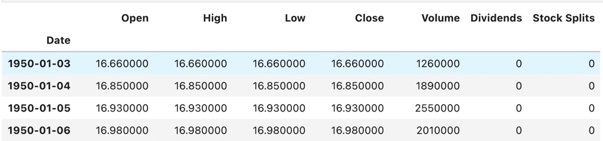

# Notes

- [Notes](#notes)
  - [Predict The Stock Market With Machine Learning And Python](#predict-the-stock-market-with-machine-learning-and-python)
    - [Downloading the data from Yahoo Finance:](#downloading-the-data-from-yahoo-finance)
    - [Cleaning and visualising the data](#cleaning-and-visualising-the-data)
    - [Defining the target of our ML prediction](#defining-the-target-of-our-ml-prediction)
    - [Removing old data that is likely to be less relevant](#removing-old-data-that-is-likely-to-be-less-relevant)
    - [Training initial model](#training-initial-model)


## Predict The Stock Market With Machine Learning And Python

Notes from https://www.youtube.com/watch?v=1O_BenficgE

- Many real world considerations to take into account when predicting stock prices

### Downloading the data from Yahoo Finance:

```python
import yfinance as yf
sp500 = yf.download("^GSPC)
sp500=sp500.history(period="max")
```

Result is a Pandas Dataframe:



Each row a trading day - non-trading days are omitted
The columns are:

- Open: The price of the stock at the beginning of the trading day (it need not be the closing price of the previous trading day)
- High: The highest price of the stock on that trading day
- Low: The lowest price of the stock on that trading day
- Close: The price of the stock at closing time
- Volume: How many stocks were traded
- Dividends: Dividends paid by the company
- Stock Splits: If the company splits its stocks, this is the ratio

The index of the data can be found with:

```python
sp500.index
```

This shows that the data is indexed by date

### Cleaning and visualising the data

The first step is to plot the closing price of the stock:

```python
sp500.plot(y="Close", use_index=True)
```


We can now remove the columns we are ignoring for the moment for simplicity as we are looking at the whole index not individual stocks:

```python
del sp500["Dividends"]
del sp500["Stock Splits"]
```

### Defining the target of our ML prediction

We want to predict whether the price will go up or down tomorrow. We want to be able to predict this with a high degree of accuracy so our model needs
to say the market will go up on days where it does go up. We can then buy stocks knowing the market is on the up.

First we create a new column called `Tomorrow` which will be the price for market close tomorrow. We can initialise this with the shift operation
which will take the `Close` of the day before and set it as the `Tomorrow` of the day before:

```python
sp500["Tomorrow"] = sp500["Close"].shift(-1)
```

Next we create a Target which is whether todays close is higher than tomorrows close:

```python
sp500["Target"] = (sp500["Tomorrow"] > sp500["Close"]).astype(int)
```

Our data frame now looks like this:


### Removing old data that is likely to be less relevant

We can remove the data prior to 1990 as it is likely to be less relevant/reliable:

```python
sp500 = sp500.loc["1990-01-01":].copy()
```

### Training initial model

Now we have our data we can train an initial model on the data:

```python
from sklearn.ensemble import RandomForestClassifier

model = RandomForestClassifier(n_estimators=100, min_smaples_split=100, random_state=42)

train = sp500.iloc[0:-100] # All but the last 100 rows

test = sp500.iloc[-100:] # The last 100 rows

predictors = ["Close", "Open", "High", "Low", "Volume"] # columns the model may use to predict
model.fit(train[predictors], train["Target"]) # Train the model using the predictors trying to predict the target
```

Where:

- `RandomForestClassifier` is an approach that works by training a number of decision trees on random subsets of the features and then averaging the results. This is
resistant to overfitting and is a good starting point for a model as it runs fairly quickly and can pick up non-linear relationships.
- `n_estimators` is the number of trees in the forest
- `min_samples_split` is the minimum number of samples required to split an internal node - the higher this is the more resistant to overfit (at the cost of accuracy)
- `random_state` is the seed used by the random number generator and allows you to repeatably train the model

Time series data like this cannot use cross validation. This is because though it may train well it will do badly in the real world. For example if you try to predict tomoorws
stock price based on data about what it will be in 30 days you will likely do better but this is not feasible in a real world scenario. 

After running the model we can see the accuracy to see if it is working:

```python
import pandas as pd
from sklearn.metrics import precision_score # this is a good metric for this type of model as it is favouring precision

predictions = model.predict(test[predictors])

predictions = pd.Series(predictions, index=test.index) # easier to work with in this format (previous command returns a numpy array)

precision_score(test["Target"], predictions)
```

The result of this is  0.4235294117647059 which is not great. This means we only said the stock market would go up and it did 42% of the time. This is not good enough to make
any money :) we would actually be better doing the opposite of what the model says!

This is part of the process though and we can now look at improving the model.

continue from 16m06