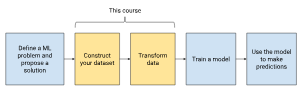

# Data Preparation and Feature Engineering in ML

Machine learning helps us find patterns in data—patterns we then use to make predictions about new data points. To get those predictions right, we must construct the [data set](https://developers.google.com/machine-learning/glossary/#data_set) and transform the data correctly. This course covers these two key steps. We'll also see how training/serving considerations play into these steps.

## Course Learning Objectives

- Recognize the relative impact of data quality and size to algorithms.
- Set informed and realistic expectations for the time to transform the data.
- Explain a typical process for data collection and transformation within the overall ML workflow.
- Collect raw data and construct a data set.
- Sample and split your data set with considerations for imbalanced data.
- Transform numerical and categorical data.

## Why Learn About Data Preparation and Feature Engineering? 

You can think of feature engineering as helping the model to understand the data set in the same way you do. Learners often come to a machine learning course focused on model building, but end up spending much more time focusing on data.

For the following question, click the desired arrow to check your answer:

If you had to prioritize improving one of the areas below in your machine learning project, which would have the most impact?

- A more clever loss function
- Using the latest optimization algorithm
 -The quality and size of your data
- A deeper network

> Answer: The quality and size of your data
> Data trumps all. It's true that updating your learning algorithm or model architecture will let you learn different types of patterns, but if your data is > bad, you will end up building functions that fit the wrong thing. The quality and size of the data set matters much more than which shiny algorithm you use.

## Why is Collecting a Good Data Set Important?

### Google Translate

The Google Translate team has more training data than they can use. Rather than tuning their model, the team has earned bigger wins by using the best features in their data.

"...one of our most impactful quality advances since neural machine translation has been in identifying the best subset of our training data to use"
- Software Engineer, Google Translate

"...most of the times when I tried to manually debug interesting-looking errors they could be traced back to issues with the training data." - Software Engineer, Google Translate

"Interesting-looking" errors are typically caused by the data. Faulty data may cause your model to learn the wrong patterns, regardless of what modeling techniques you try.
 

### Brain's Diabetic Retinopathy Project

Google Brain's diabetic retinopathy project employed a neural network architecture, known as Inception, to detect disease by classifying images. The team didn't tweak models. Instead, they succeeded by creating a data set of 120,000 examples labeled by ophthalmologists. (Learn more at https://research.google.com/pubs/pub43022.html)

https://developers.google.com/machine-learning/data-prep/process