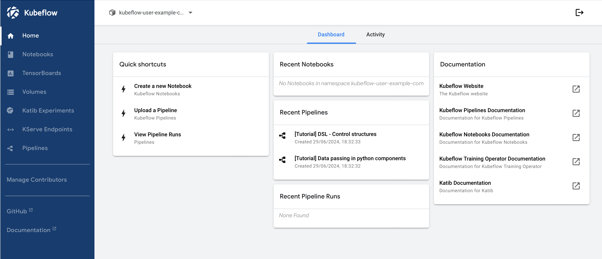

# Kubeflow Environment Setup

- [Kubeflow Environment Setup](#kubeflow-environment-setup)
  - [Local KubeFlow Setup](#local-kubeflow-setup)
    - [1. Install Vagrant](#1-install-vagrant)
    - [2. Install MiniKube](#2-install-minikube)
    - [3. Install kubeflow](#3-install-kubeflow)
    - [4. Check pods up](#4-check-pods-up)
    - [5. Kubeflow UI](#5-kubeflow-ui)
  - [Install on a Remote Ubuntu VM](#install-on-a-remote-ubuntu-vm)
  - [Build an ML Pipeline](#build-an-ml-pipeline)


## Local KubeFlow Setup

After trying so many variants to get this working on MacBook I ended up with this one https://dagshub.com/blog/how-to-install-kubeflow-locally/ which worked well

### 1. Install Vagrant

```bash
brew tap hashicorp/tap
brew install hashicorp/tap/hashicorp-vagrant
```

### 2. Install MiniKube

```bash
brew install minikube kustomize
```

### 3. Install kubeflow

```bash
git clone https://github.com/kubeflow/manifests.git
cd mainifests
while ! kustomize build example | awk '!/well-defined/' | kubectl apply -f -; do echo "Retrying to apply resources"; sleep 10; done
```

### 4. Check pods up

```bash
kubectl get pods -A
NAMESPACE                   NAME                                                     READY   STATUS      RESTARTS        AGE
auth                        dex-5f5c9d96bf-nxp8b                                     1/1     Running     1 (4m12s ago)   16h
cert-manager                cert-manager-5fcfc99f7-7bd2j                             1/1     Running     2 (4m12s ago)   16h
cert-manager                cert-manager-cainjector-75cfc9f6b7-6fclb                 1/1     Running     1 (4m12s ago)   16h
cert-manager                cert-manager-webhook-74b65dbf6f-tfgrh                    1/1     Running     1 (4m12s ago)   16h
istio-system                cluster-local-gateway-64565d7fc8-qtc9x                   1/1     Running     1 (4m12s ago)   16h
istio-system                istio-ingressgateway-bdd5f64f7-rhsh7                     1/1     Running     1 (4m12s ago)   16h
istio-system                istiod-6fb944749d-wjwzk                                  1/1     Running     1 (4m12s ago)   16h
istio-system                kubeflow-m2m-oidc-configurator-28662380-dv7qz            0/1     Completed   0               3m45s
knative-eventing            eventing-controller-589bb6b4cf-mv99b                     1/1     Running     1 (4m12s ago)   16h
knative-eventing            eventing-webhook-b875f7d6d-h4z7j                         1/1     Running     2 (4m12s ago)   16h
knative-serving             activator-7d8b9586c-hm66l                                2/2     Running     2 (4m12s ago)   16h
knative-serving             autoscaler-bbf5c5b76-tm2lg                               2/2     Running     2 (4m12s ago)   16h
knative-serving             controller-56c5d7db7b-fm4zt                              2/2     Running     3 (3m26s ago)   16h
knative-serving             net-istio-controller-67dcc79c56-hctqd                    2/2     Running     3 (3m28s ago)   16h
knative-serving             net-istio-webhook-75b7f9d555-jjwfx                       2/2     Running     5 (3m1s ago)    16h
knative-serving             webhook-6d8468dd7f-fj9tl                                 2/2     Running     3 (3m28s ago)   16h
kube-system                 coredns-7db6d8ff4d-h2mhc                                 1/1     Running     1 (4m12s ago)   17h
kube-system                 etcd-minikube                                            1/1     Running     1 (4m12s ago)   17h
kube-system                 kube-apiserver-minikube                                  1/1     Running     1 (4m12s ago)   17h
kube-system                 kube-controller-manager-minikube                         1/1     Running     1 (4m12s ago)   17h
kube-system                 kube-proxy-4ftrg                                         1/1     Running     1 (4m12s ago)   17h
kube-system                 kube-scheduler-minikube                                  1/1     Running     1 (4m12s ago)   17h
kube-system                 storage-provisioner                                      1/1     Running     3 (3m27s ago)   17h
kubeflow-user-example-com   ml-pipeline-ui-artifact-56dcf4989-rwz64                  2/2     Running     2 (4m12s ago)   16h
kubeflow-user-example-com   ml-pipeline-visualizationserver-58887bbbf5-nzz5h         0/2     Pending     0               16h
kubeflow                    admission-webhook-deployment-79dff4dc78-gs4fd            1/1     Running     1 (4m12s ago)   16h
kubeflow                    cache-server-58f5d8c7d5-m75fx                            2/2     Running     2 (4m12s ago)   16h
kubeflow                    centraldashboard-5f6cdc589f-crgvn                        2/2     Running     2 (4m12s ago)   16h
kubeflow                    jupyter-web-app-deployment-5b55697868-jwnph              2/2     Running     2 (4m12s ago)   16h
kubeflow                    katib-controller-8584b7ffd6-h9r98                        1/1     Running     2 (4m12s ago)   16h
kubeflow                    katib-db-manager-696d8fb4ff-jxxcq                        1/1     Running     7 (4m12s ago)   16h
kubeflow                    katib-mysql-74f9795f8b-2tb7k                             1/1     Running     2 (4m12s ago)   16h
kubeflow                    katib-ui-ddcc9d75c-2w7md                                 2/2     Running     2 (4m12s ago)   16h
kubeflow                    kserve-controller-manager-b96c76496-sn6tw                2/2     Running     4 (4m12s ago)   16h
kubeflow                    kserve-models-web-app-5d7d5857df-q7cpj                   2/2     Running     2 (4m12s ago)   16h
kubeflow                    kubeflow-pipelines-profile-controller-7795c68cfd-2fdmd   1/1     Running     1 (4m12s ago)   16h
kubeflow                    metacontroller-0                                         1/1     Running     1 (4m12s ago)   16h
kubeflow                    metadata-envoy-deployment-758c78ccb9-87lks               1/1     Running     1 (4m12s ago)   16h
kubeflow                    metadata-grpc-deployment-68d6f447cc-vfltx                2/2     Running     6 (3m6s ago)    16h
kubeflow                    metadata-writer-5495b59ffd-k5jlg                         2/2     Running     2 (4m12s ago)   16h
kubeflow                    minio-59b68688b5-676wh                                   2/2     Running     2 (4m12s ago)   16h
kubeflow                    ml-pipeline-cd5945965-ps5xd                              2/2     Running     9 (4m12s ago)   16h
kubeflow                    ml-pipeline-persistenceagent-5679776bbf-txcz8            2/2     Running     2 (4m12s ago)   16h
kubeflow                    ml-pipeline-scheduledworkflow-b6658c7c-zm496             2/2     Running     2 (4m12s ago)   16h
kubeflow                    ml-pipeline-ui-577d569cc8-5g2mj                          2/2     Running     9 (4m12s ago)   16h
kubeflow                    ml-pipeline-viewer-crd-56d7584db6-lxbxv                  2/2     Running     4 (3m29s ago)   16h
kubeflow                    ml-pipeline-visualizationserver-5f57d6b9cf-w2w5t         0/2     Pending     0               16h
kubeflow                    mysql-5f8cbd6df7-l56j9                                   2/2     Running     2 (4m12s ago)   16h
kubeflow                    notebook-controller-deployment-5984c8fc69-sppwj          2/2     Running     5 (3m30s ago)   16h
kubeflow                    profiles-deployment-cbd4b5df7-4pqcl                      3/3     Running     6 (3m7s ago)    16h
kubeflow                    pvcviewer-controller-manager-6cb774477-n5ffn             3/3     Running     4 (4m12s ago)   16h
kubeflow                    tensorboard-controller-deployment-6b9965f774-hsb6c       3/3     Running     6 (3m20s ago)   16h
kubeflow                    tensorboards-web-app-deployment-9dc59597c-r2sxq          2/2     Running     2 (4m12s ago)   16h
kubeflow                    training-operator-6647f8d865-p8lk4                       1/1     Running     1 (4m12s ago)   16h
kubeflow                    volumes-web-app-deployment-66c4454c55-rl4w5              2/2     Running     2 (4m12s ago)   16h
kubeflow                    workflow-controller-7c9c86b578-5j56x                     2/2     Running     7 (3m13s ago)   16h
oauth2-proxy                oauth2-proxy-68df7496c4-rsv48                            1/1     Running     1 (4m12s ago)   16h
oauth2-proxy                oauth2-proxy-68df7496c4-w6rbb                            1/1     Running     1 (4m12s ago)   16h
```

### 5. Kubeflow UI

Expose outside the cluster

```bash
kubectl port-forward svc/istio-ingressgateway -n istio-system 8080:80
```

The default username is user@example.com and the password is 12341234. Once you log in, you will be greeted by the Kubeflow dashboard.



## Install on a Remote Ubuntu VM

https://charmed-kubeflow.io/docs/get-started-with-charmed-kubeflow


## Build an ML Pipeline

Going to try this with help from this [blog](https://blogs.cisco.com/developer/readyformlops01?ccid=ai-page&dtid=devblog&oid=florianpachinger-fy23-q1-0000-machinelearningops03-ww)