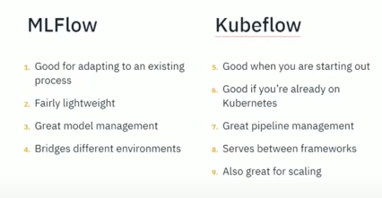

# MLOps

## Good resources

### Build an ML Pipeline

Going to try this with help from this blog:

[part 1](https://blogs.cisco.com/developer/readyformlops01)
[part 2](https://blogs.cisco.com/developer/machinelearningpipeline01)
[part 3](https://blogs.cisco.com/developer/machinelearningops03)

### Datacamp on basics

Also see these resources:
- https://www.datacamp.com/tutorial/kubeflow-tutorial-building-and-deploying-machine-learning-pipelines
- https://www.datacamp.com/tutorial/tutorial-machine-learning-pipelines-mlops-deployment

## Notes from End-to-End MLOps with MLflow and Kubeflow - Nick Chase, CloudGeometry

### What is MLOps?

- similar to devops (CICD, secure supply chain, monitoring)
- not just devops for ML also
  - code, data and models
  - regulated industires / where did data come from
  - scientific pursuits where need hallucination close to zero
- tools - kubeflow and mlflow are too big ones of OSS world but many others

### MLFlow

- open source - managed by databricks
- digital lab notebook - looks after everything to do with your ML so easy to share & track experiments - training runs, artifacts
- key functionality - tracking, models, projects, registry, plugins, authN
- in a nutshell it is like having tracking and a record of all the python noptebook runs you do so it is audited 
- can easily extract models as a python function or package up in a standard format

### What is KubeFlow

- MLOps from google
- Based in kubernetes - strength or weakness
- Uses CRDs and operators
- Components
  - notebooks - same as jupyter
  - models
  - katib - autoML
  - training operators - how kubeflow does ML
  - kserve - serving models
  - pipelines - 
- Kubeflow notebooks - based in k8s itself, not just jupyterlab, theoretically can be any IDE image, runs in a pod
- Katib - autoML tool, aims to automate time consuming tasks like hyperparameter tuning, supports multiple frameworks, neural architecture search
- Training operators - supports Tensorflow, PaddlePaddle, Pytorch, MXNet, XGBoost, MPI
- KServe - serverless mechanism of deploying / serving an ML model

### MLFlow or Kubeflow?

