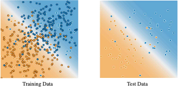
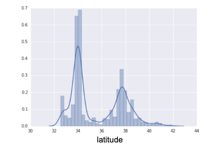
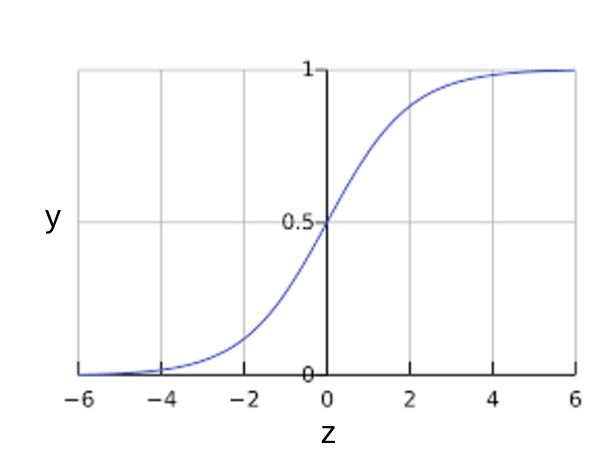

# Machine learning crash course

- [Machine learning crash course](#machine-learning-crash-course)
  - [Refs](#refs)
  - [Introduction to Machine Learning](#introduction-to-machine-learning)
    - [What is (supervised) machine learning? Concisely put, it is the following:](#what-is-supervised-machine-learning-concisely-put-it-is-the-following)
    - [Labels](#labels)
    - [Features](#features)
    - [Examples](#examples)
    - [Models](#models)
    - [Regression vs. classification](#regression-vs-classification)
    - [Some questions](#some-questions)
  - [Descending into ML](#descending-into-ml)
    - [Descending into ML: Linear Regression](#descending-into-ml-linear-regression)
    - [Descending into ML: Training and Loss](#descending-into-ml-training-and-loss)
      - [Squared loss: a popular loss function](#squared-loss-a-popular-loss-function)
  - [Reducing Loss](#reducing-loss)
    - [Reducing Loss: Gradient Descent](#reducing-loss-gradient-descent)
      - [Partial Derrivatives](#partial-derrivatives)
      - [Gradients](#gradients)
    - [Reducing Loss: Learning Rate](#reducing-loss-learning-rate)
      - [Maths aside on Learning Rate](#maths-aside-on-learning-rate)
    - [Reducing Loss: Stochastic Gradient Descent](#reducing-loss-stochastic-gradient-descent)
  - [First steps with TensorFlow](#first-steps-with-tensorflow)
    - [First Steps with TensorFlow: Programming Exercises](#first-steps-with-tensorflow-programming-exercises)
    - [NumPy and pandas](#numpy-and-pandas)
    - [Linear regression with tf.keras](#linear-regression-with-tfkeras)
  - [Generalization](#generalization)
    - [Low loss, but still a bad model?](#low-loss-but-still-a-bad-model)
    - [The ML fine print](#the-ml-fine-print)
  - [Training and Test Sets](#training-and-test-sets)
    - [Training and Test Sets: Splitting Data](#training-and-test-sets-splitting-data)
  - [Validation Set](#validation-set)
    - [Validation Set: Another Partition](#validation-set-another-partition)
    - [Validation Sets and Test Sets: Programming Exercise](#validation-sets-and-test-sets-programming-exercise)
  - [Representation](#representation)
    - [Representation: Feature Engineering](#representation-feature-engineering)
      - [Mapping Raw Data to Features](#mapping-raw-data-to-features)
      - [Mapping numeric values](#mapping-numeric-values)
      - [Mapping categorical values](#mapping-categorical-values)
      - [Sparse Representation](#sparse-representation)
    - [Representation: Qualities of Good Features](#representation-qualities-of-good-features)
      - [Avoid rarely used discrete feature values](#avoid-rarely-used-discrete-feature-values)
      - [Prefer clear and obvious meanings](#prefer-clear-and-obvious-meanings)
      - [Don't mix "magic" values with actual data](#dont-mix-magic-values-with-actual-data)
      - [Account for upstream instability](#account-for-upstream-instability)
    - [Representation: Cleaning Data](#representation-cleaning-data)
      - [Scaling feature values](#scaling-feature-values)
      - [Handling extreme outliers](#handling-extreme-outliers)
      - [Binning](#binning)
      - [Scrubbing](#scrubbing)
      - [Know your data](#know-your-data)
  - [Feature Crosses](#feature-crosses)
    - [Feature Crosses: Encoding Nonlinearity](#feature-crosses-encoding-nonlinearity)
      - [Kinds of feature crosses](#kinds-of-feature-crosses)
    - [Feature Crosses: Crossing One-Hot Vectors](#feature-crosses-crossing-one-hot-vectors)
    - [Feature Crosses: Programming Exercise](#feature-crosses-programming-exercise)
  - [Regularization for Simplicity](#regularization-for-simplicity)
    - [L2 Regularization](#l2-regularization)
    - [Regularization for Simplicity: Lambda](#regularization-for-simplicity-lambda)
      - [$L\_2$ Regularization and learning rate](#l_2-regularization-and-learning-rate)
    - [$L\_2$ Regularization Knowledge Check](#l_2-regularization-knowledge-check)
  - [Logistic Regression](#logistic-regression)
    - [Logistic Regression: Calculating a Probability](#logistic-regression-calculating-a-probability)
    - [Logistic Regression: Loss and Regularization](#logistic-regression-loss-and-regularization)
      - [Loss function for Logistic Regression](#loss-function-for-logistic-regression)
      - [Regularization in Logistic Regression](#regularization-in-logistic-regression)
  - [Classification](#classification)
    - [Classification: Thresholding](#classification-thresholding)
    - [Classification: True vs. False and Positive vs. Negative](#classification-true-vs-false-and-positive-vs-negative)
    - [Classification: Accuracy](#classification-accuracy)
    - [Classification: Precision and Recall](#classification-precision-and-recall)
      - [Recall](#recall)
      - [Precision and Recall: A Tug of War](#precision-and-recall-a-tug-of-war)


## Refs

- notes from course https://developers.google.com/machine-learning/crash-course/ml-intro

## Introduction to Machine Learning

- can achieve many things difficult to quick do in logical programs
- using statistics rather than logic

## Key ML Terminology

### What is (supervised) machine learning? Concisely put, it is the following:

ML systems learn how to combine input to produce useful predictions on never-before-seen data.

### Labels

A label is the thing we're predicting—the y variable in simple linear regression. The label could be the future price of wheat, the kind of animal shown in a picture, the meaning of an audio clip, or just about anything.

### Features

A feature is an input variable—the x variable in simple linear regression. A simple machine learning project might use a single feature, while a more sophisticated machine learning project could use millions of features, specified as:

In the spam detector example, the features could include the following:

- words in the email text
- sender's address
 -time of day the email was sent
 -email contains the phrase "one weird trick."

### Examples

An example is a particular instance of data, x. (We put x in boldface to indicate that it is a vector.) We break examples into two categories:

- labeled examples
 -unlabeled examples

A labeled example includes both feature(s) and the label. That is:

>  labeled examples: {features, label}: (x, y)

Use labeled examples to train the model. In our spam detector example, the labeled examples would be individual emails that users have explicitly marked as "spam" or "not spam."

For example, the following table shows 5 labeled examples from a data set containing information about housing prices in California:

| housing MedianAge (feature)	| totalRooms (feature)    | totalBedrooms (feature)	| medianHouseValue (label) |
| 15	                        | 5612                    | 	1283	            | 66900 |
| 19	                        | 7650                    | 	1901	            | 80100 |
| 17	                        | 720	                  |      174	            | 85700 |
| 14	                        | 1501                    | 	 337	            | 73400 |
| 20	                        | 1454                    | 	 326	            | 65500 |

An unlabeled example contains features but not the label. That is:

>  unlabeled examples: {features, ?}: (x, ?)

Here are 3 unlabeled examples from the same housing dataset, which exclude medianHouseValue:

| housingMedianAge  (feature)	| totalRooms (feature)	    | totalBedrooms (feature) |
| 42	                        | 1686	                    |  361 |
| 34	                        | 1226	                    |  180 |
| 33	                        | 1077	                    |  271 |

Once we've trained our model with labeled examples, we use that model to predict the label on unlabeled examples. In the spam detector, unlabeled examples are new emails that humans haven't yet labeled.

### Models

A model defines the relationship between features and label. For example, a spam detection model might associate certain features strongly with "spam". Let's highlight two phases of a model's life:

Training means creating or learning the model. That is, you show the model labeled examples and enable the model to gradually learn the relationships between features and label.

Inference means applying the trained model to unlabeled examples. That is, you use the trained model to make useful predictions (y'). For example, during inference, you can predict medianHouseValue for new unlabeled examples.

### Regression vs. classification

A regression model predicts continuous values. For example, regression models make predictions that answer questions like the following:

What is the value of a house in California?

What is the probability that a user will click on this ad?

A classification model predicts discrete values. For example, classification models make predictions that answer questions like the following:

Is a given email message spam or not spam?

Is this an image of a dog, a cat, or a hamster?

### Some questions


## Descending into ML

### Descending into ML: Linear Regression

Linear regression is a method for finding the straight line or hyperplane that best fits a set of points. 

It has long been known that crickets (an insect species) chirp more frequently on hotter days than on cooler days. For decades, professional and amateur scientists have cataloged data on chirps-per-minute and temperature. As a birthday gift, your Aunt Ruth gives you her cricket database and asks you to learn a model to predict this relationship. Using this data, you want to explore this relationship.

First, examine your data by plotting it:


**Figure 1. Chirps per Minute vs. Temperature in Celsius.**

As expected, the plot shows the temperature rising with the number of chirps. Is this relationship between chirps and temperature linear? Yes, you could draw a single straight line like the following to approximate this relationship:


**Figure 2. A linear relationship.**

True, the line doesn't pass through every dot, but the line does clearly show the relationship between chirps and temperature. Using the equation for a line, you could write down this relationship as follows:

$y = mx + b$

where:

- $y$ is the temperature in Celsius—the value we're trying to predict.
- $m$ is the slope of the line.
- $x$ is the number of chirps per minute—the value of our input feature.
- $b$ is the y-intercept.

By convention in machine learning, you'll write the equation for a model slightly differently:

$y' = b + w_1x_1$

where:

- $y'$ is the predicted label (a desired output).
- $b$ is the bias (the y-intercept), sometimes referred to as 
- $w_1$ is the weight of feature 1. Weight is the same concept as the "slope" $m$ in the traditional equation of a line.
- $x_1$ is a feature (a known input).

To infer (predict) the temperature $y'$ for a new chirps-per-minute value $x_1$, just substitute the value into this model. Although this model uses only one feature, a more sophisticated model might rely on multiple features, each having a separate weight ($w_1$, $w_2$, etc.). For example, a model that relies on three features might look as follows:

$y' = b + w_1x_1 + w_2x_2 + w_3x_3$

### Descending into ML: Training and Loss

**Training** a model simply means learning (determining) good values for all the weights and the bias from labeled examples. In supervised learning, a machine learning algorithm builds a model by examining many examples and attempting to find a model that minimizes loss; this process is called **empirical risk minimization**.

Loss is the penalty for a bad prediction. That is, **loss** is a number indicating how bad the model's prediction was on a single example. **If the model's prediction is perfect, the loss is zero**; otherwise, the loss is greater. **The goal of training a model is to find a set of weights and biases that have low loss, on average, across all examples**. For example, Figure 3 shows a high loss model on the left and a low loss model on the right. Note the following about the figure:

- The arrows represent loss.
- The blue lines represent predictions.


**Figure 3. High loss in the left model; low loss in the right model.**

 
Notice that the arrows in the left plot are much longer than their counterparts in the right plot. Clearly, the line in the right plot is a much better predictive model than the line in the left plot.

You might be wondering whether you could create a mathematical function—a loss function—that would aggregate the individual losses in a meaningful fashion.

#### Squared loss: a popular loss function

The linear regression models we'll examine here use a loss function called squared loss (also known as **$L_2$ loss**). The squared loss for a single example is as follows:

```
  = the square of the difference between the label and the prediction
  = (observation - prediction(x))2
  = (y - y')2
```

Mean square error (MSE) is the average squared loss per example over the whole dataset. To calculate MSE, sum up all the squared losses for individual examples and then divide by the number of examples:

$MSE = \frac{1}{N} \sum_{(x,y)\in D} (y - prediction(x))^2$

where:

 - $(x,y)$ is an example in which
   - $x$ is the set of features (for example, chirps/minute, age, gender) that the model uses to make predictions.
   - $y$ is the example's label (for example, temperature).
 - $prediction(x)$ is a function of the weights and bias in combination with the set of features.
 - $D$  is a data set containing many labeled examples, which are $(x,y)$ pairs.
 - $N$ is the number of examples in $D$.

Although MSE is commonly-used in machine learning, it is neither the only practical loss function nor the best loss function for all circumstances.

## Reducing Loss

Here, in this module, you'll learn how a machine learning model iteratively reduces loss.

Iterative learning might remind you of the "Hot and Cold" kid's game for finding a hidden object like a thimble. In this game, the "hidden object" is the best possible model. You'll start with a wild guess ("The value of $w_1$ is 0.") and wait for the system to tell you what the loss is. Then, you'll try another guess ("The value of $w_1$ is 0.5.") and see what the loss is. Aah, you're getting warmer. Actually, if you play this game right, you'll usually be getting warmer. The real trick to the game is trying to find the best possible model as efficiently as possible.

The following figure suggests the iterative trial-and-error process that machine learning algorithms use to train a model:


**Figure 1. An iterative approach to training a model.**

We'll use this same iterative approach throughout the Machine Learning Crash Course, detailing various complications, particularly within that stormy cloud labeled "Model (Prediction Function)." Iterative strategies are prevalent in machine learning, primarily because they scale so well to large data sets.

The "model" takes one or more features as input and returns one prediction ($y'$) as output. To simplify, consider a model that takes one feature and returns one prediction:

$y' = b + w_1x_1$

What initial values should we set for $b$ and $w_1$? For linear regression problems, it turns out that the starting values aren't important. We could pick random values, but we'll just take the following trivial values instead:

- $b$ = 0
- $w_1$ = 0

Suppose that the first feature value is 10. Plugging that feature value into the prediction function yields:

$y' = 0 + 0 \cdot 10 = 0$

The "Compute Loss" part of the diagram is the loss function that the model will use. Suppose we use the squared loss function. The loss function takes in two input values:

- $y'$: The model's prediction for features x
- $y$: The correct label corresponding to features x.

At last, we've reached the "Compute parameter updates" part of the diagram. It is here that the machine learning system examines the value of the loss function and generates new values for $b$ and $w_1$. For now, just assume that this mysterious box devises new values and then the machine learning system re-evaluates all those features against all those labels, yielding a new value for the loss function, which yields new parameter values. And the learning continues iterating until the algorithm discovers the model parameters with the lowest possible loss. Usually, you iterate until overall loss stops changing or at least changes extremely slowly. When that happens, we say that the model has converged.

### Reducing Loss: Gradient Descent

The iterative approach diagram (Figure 1) contained a green hand-wavy box entitled "Compute parameter updates." We'll now replace that algorithmic fairy dust with something more substantial.

Suppose we had the time and the computing resources to calculate the loss for all possible values of $w_1$. For the kind of regression problems we've been examining, the resulting plot of loss vs. $w_1$ will always be convex. In other words, the plot will always be bowl-shaped, kind of like this:


**Figure 2. Regression problems yield convex loss vs. weight plots.**

Convex problems have only one minimum; that is, only one place where the slope is exactly 0. That minimum is where the loss function converges.

Calculating the loss function for every conceivable value of $w_1$ over the entire data set would be an inefficient way of finding the convergence point. Let's examine a better mechanism—very popular in machine learning—called **gradient descent**.

The first stage in gradient descent is to pick a starting value (a starting point) for $w_1$. The starting point doesn't matter much; therefore, many algorithms simply set $w_1$ to 0 or pick a random value. The following figure shows that we've picked a starting point slightly greater than 0:


**Figure 3. A starting point for gradient descent.**

The gradient descent algorithm then calculates the gradient of the loss curve at the starting point. Here in Figure 3, the gradient of the loss is equal to the derivative (slope) of the curve, and tells you which way is "warmer" or "colder." When there are multiple weights, the **gradient** is a vector of partial derivatives with respect to the weights.

#### Partial Derrivatives

The math around machine learning is fascinating and we're delighted that you clicked the link to learn more. Please note, however, that TensorFlow handles all the gradient computations for you, so you don't actually have to understand the calculus provided here.

A **multivariable function** is a function with more than one argument, such as:

$f(x,y) = e^{2y}\sin(x)$

The **partial derivative** $f$ with respect to $x$, denoted as follows:

$\partial f \over \partial x$

is the derivative of $f$ considered as a function of $x$ alone. To find the following:

$\partial f \over \partial x$

you must hold $y$  constant (so $f$ is now a function of one variable $x$), and take the regular derivative of $f$ with respect to $x$. For example, when $y$ is fixed at 1, the preceding function becomes:

$f(x) = e^2\sin(x)$

This is just a function of one variable $x$, whose derivative is:

$e^2\cos(x)$

In general, thinking of $y$ as fixed, the partial derivative of $f$  with respect to $x$  is calculated as follows:

$\frac{\partial f}{\partial x}(x,y) = e^{2y}\cos(x)$

Similarly, if we hold $x$ fixed instead, the partial derivative of $f$ with respect to $y$ is:

$\frac{\partial f}{\partial y}(x,y) = 2e^{2y}\sin(x)$

Intuitively, a partial derivative tells you how much the function changes when you perturb one variable a bit. In the preceding example:

$\frac{\partial f}{\partial x} (0,1) = e^2 \approx 7.4$

So when you start at $(0, 1)$, hold $y$ constant, and move $x$ a little, $f$ changes by about 7.4 times the amount that you changed $x$.

In machine learning, partial derivatives are mostly used in conjunction with the gradient of a function.

#### Gradients

The gradient of a function, denoted as follows, is the vector of partial derivatives with respect to all of the independent variables:

$\nabla f$

For instance, if:

$f(x,y) = e^{2y}\sin(x)$

then:

$\nabla f(x,y) = \left(\frac{\partial f}{\partial x}(x,y), \frac{\partial f}{\partial y}(x,y)\right) = (e^{2y}\cos(x), 2e^{2y}\sin(x))$

Note the following:

- $\nabla f$ Points in the direction of greatest increase of the function.
- ${-\nabla f}$ Points in the direction of greatest decrease of the function.
- 
The number of dimensions in the vector is equal to the number of variables in the formula for $f$; in other words, the vector falls within the domain space of the function. For instance, the graph of the following function $f(x,y)$:

$f(x,y) = 4 + (x - 2)^2 + 2y^2$

when viewed in three dimensions with $z = f(x, y)$ looks like a valley with a minimum at $(2, 0, 4)$:

![three-d gully(../images/3d-gully.png)

The gradient of $f(x, y)$ is a two-dimensional vector that tells you in which $(x, y)$ direction to move for the maximum increase in height. Thus, the negative of the gradient moves you in the direction of maximum decrease in height. In other words, the negative of the gradient vector points into the valley.

In machine learning, gradients are used in gradient descent. We often have a loss function of many variables that we are trying to minimize, and we try to do this by following the negative of the gradient of the function.

Note that a gradient is a vector, so it has both of the following characteristics:

- a direction
- a magnitude

The gradient always points in the direction of steepest increase in the loss function. The gradient descent algorithm takes a step in the direction of the negative gradient in order to reduce loss as quickly as possible.


**Figure 4. Gradient descent relies on negative gradients.**

To determine the next point along the loss function curve, the gradient descent algorithm adds some fraction of the gradient's magnitude to the starting point as shown in the following figure:


**Figure 5. A gradient step moves us to the next point on the loss curve.**

The gradient descent then repeats this process, edging ever closer to the minimum

### Reducing Loss: Learning Rate

As noted, the gradient vector has both a direction and a magnitude. Gradient descent algorithms multiply the gradient by a scalar known as the **learning rate** (also sometimes called **step size**) to determine the next point. For example, if the gradient magnitude is 2.5 and the learning rate is 0.01, then the gradient descent algorithm will pick the next point 0.025 away from the previous point.

**Hyperparameters** are the knobs that programmers tweak in machine learning algorithms. Most machine learning programmers spend a fair amount of time tuning the learning rate. If you pick a learning rate that is too small, learning will take too long:


**Figure 6. Learning rate is too small.**

Conversely, if you specify a learning rate that is too large, the next point will perpetually bounce haphazardly across the bottom of the well like a quantum mechanics experiment gone horribly wrong:


**Figure 7. Learning rate is too large.**

There's a Goldilocks learning rate for every regression problem. The Goldilocks value is related to how flat the loss function is. If you know the gradient of the loss function is small then you can safely try a larger learning rate, which compensates for the small gradient and results in a larger step size.


**Figure 8. Learning rate is just right.**

#### Maths aside on Learning Rate

The ideal learning rate in one-dimension is $\frac{ 1 }{ f''(x) }$ (the inverse of the second derivative of $f(x)$ at $x$).

The ideal learning rate for 2 or more dimensions is the inverse of the [Hessian](https://wikipedia.org/wiki/Hessian_matrix) (matrix of second partial derivatives).

The story for general convex functions is more complex.

### Reducing Loss: Stochastic Gradient Descent

In gradient descent, a **batch** is the set of examples you use to calculate the gradient in a single training iteration. So far, we've assumed that the batch has been the entire data set. When working at Google scale, data sets often contain billions or even hundreds of billions of examples. Furthermore, Google data sets often contain huge numbers of features. Consequently, a batch can be enormous. A very large batch may cause even a single iteration to take a very long time to compute.

A large data set with randomly sampled examples probably contains redundant data. In fact, redundancy becomes more likely as the batch size grows. Some redundancy can be useful to smooth out noisy gradients, but enormous batches tend not to carry much more predictive value than large batches.

What if we could get the right gradient on average for much less computation? By choosing examples at random from our data set, we could estimate (albeit, noisily) a big average from a much smaller one. **Stochastic gradient descent (SGD)** takes this idea to the extreme--it uses only a single example (a batch size of 1) per iteration. Given enough iterations, SGD works but is very noisy. The term "stochastic" indicates that the one example comprising each batch is chosen at random.

**Mini-batch stochastic gradient descent (mini-batch SGD)** is a compromise between full-batch iteration and SGD. A mini-batch is typically between 10 and 1,000 examples, chosen at random. Mini-batch SGD reduces the amount of noise in SGD but is still more efficient than full-batch.

To simplify the explanation, we focused on gradient descent for a single feature. Rest assured that gradient descent also works on feature sets that contain multiple features.


## First steps with TensorFlow

TensorFlow is an end-to-end open source platform for machine learning. TensorFlow is a rich system for managing all aspects of a machine learning system; however, this class focuses on using a particular TensorFlow API to develop and train machine learning models. See the [TensorFlow documentation](https://tensorflow.org/) for complete details on the broader TensorFlow system.

TensorFlow APIs are arranged hierarchically, with the high-level APIs built on the low-level APIs. Machine learning researchers use the low-level APIs to create and explore new machine learning algorithms. In this class, you will use a high-level API named tf.keras to define and train machine learning models and to make predictions. tf.keras is the TensorFlow variant of the open-source [Keras](https://keras.io/) API.

The following figure shows the hierarchy of TensorFlow toolkits:


### First Steps with TensorFlow: Programming Exercises

As you progress through Machine Learning Crash Course, you'll put machine learning concepts into practice by coding models in tf.keras. You'll use Colab as a programming environment. Colab is Google's version of [Jupyter Notebook](https://jupyter.org/). Like Jupyter Notebook, Colab provides an interactive Python programming environment that combines text, code, graphics, and program output.

### NumPy and pandas

Using `tf.keras` requires at least a little understanding of the following two open-source Python libraries:

- [NumPy](https://numpy.org/), which simplifies representing arrays and performing linear algebra operations.
- [pandas](https://pandas.pydata.org/), which provides an easy way to represent datasets in memory.

If you are unfamiliar with NumPy or pandas, please begin by doing the following two Colab exercises:

- [NumPy UltraQuick Tutorial Colab exercise- ](https://colab.research.google.com/github/google/eng-edu/blob/main/ml/cc/exercises/numpy_ultraquick_tutorial.ipynb?utm_source=mlcc&utm_campaign=colab-external&utm_medium=referral&utm_content=numpy_tf2-colab&hl=en), which provides all the NumPy information you need for this course.
- [pandas UltraQuick Tutorial Colab exercise](https://colab.research.google.com/github/google/eng-edu/blob/main/ml/cc/exercises/pandas_dataframe_ultraquick_tutorial.ipynb?utm_source=mlcc&utm_campaign=colab-external&utm_medium=referral&utm_content=pandas_tf2-colab&hl=en), which provides all the pandas information you need for this course.

[Notes on NumPy](./NumPy-Quick-Tutorial.MD)

[Notes on Pandas](./Pandas-Quick-Tutorial.MD)

### Linear regression with tf.keras

After gaining competency in NumPy and pandas, do the following two Colab exercises to explore linear regression and hyperparameter tuning in tf.keras:

- [Linear Regression with Synthetic Data Colab exercise](https://colab.research.google.com/github/google/eng-edu/blob/main/ml/cc/exercises/linear_regression_with_synthetic_data.ipynb?utm_source=mlcc&utm_campaign=colab-external&utm_medium=referral&utm_content=linear_regression_synthetic_tf2-colab&hl=en), which explores linear regression with a toy dataset. See notes [here](./Linear-Regression-With-Synthetic-Data.MD)
- [Linear Regression with a Real Dataset Colab exercise](https://colab.research.google.com/github/google/eng-edu/blob/main/ml/cc/exercises/linear_regression_with_a_real_dataset.ipynb?utm_source=mlcc&utm_campaign=colab-external&utm_medium=referral&utm_content=linear_regression_real_tf2-colab&hl=en), which guides you through the kinds of analysis you should do on a real dataset. See notes [here](./Linear-Regression-With-Real-Data.MD)

## Generalization

Generalization refers to your model's ability to adapt properly to new, previously unseen data, drawn from the same distribution as the one used to create the model.

This module focuses on generalization. In order to develop some intuition about this concept, you're going to look at three figures. Assume that each dot in these figures represents a tree's position in a forest. The two colors have the following meanings:

The blue dots represent sick trees.
The orange dots represent healthy trees.
With that in mind, take a look at Figure 1.

This figure contains about 50 dots, half of which are blue and the other half orange. The orange dots are mainly in the southwest quadrant, though a few orange dots sneak briefly into the other three quadrants. The blue dots are mainly in the northeast quadrant, but a few of the blue dots spill into other quadrants.


**Figure 1. Sick (blue) and healthy (orange) trees.**

Can you imagine a good model for predicting subsequent sick or healthy trees? Take a moment to mentally draw an arc that divides the blues from the oranges, or mentally lasso a batch of oranges or blues. Then, look at Figure 2, which shows how a certain machine learning model separated the sick trees from the healthy trees. Note that this model produced a very low loss.


 
**Figure 2. A complex model for distinguishing sick from healthy trees.**

At first glance, the model shown in Figure 2 appeared to do an excellent job of separating the healthy trees from the sick ones. Or did it?

### Low loss, but still a bad model?

Figure 3 shows what happened when we added new data to the model. It turned out that the model adapted very poorly to the new data. Notice that the model miscategorized much of the new data.

Same illustration as Figure 2, except with about a 100 more dots added.  Many of the new dots fall well outside of the predicted model.


**Figure 3. The model did a bad job predicting new data.**

The model shown in Figures 2 and 3 **overfits** the peculiarities of the data it trained on. An overfit model gets a low loss during training but does a poor job predicting new data. If a model fits the current sample well, how can we trust that it will make good predictions on new data? As you'll see [later on](https://developers.google.com/machine-learning/crash-course/regularization-for-simplicity/l2-regularization), overfitting is caused by making a model more complex than necessary. The fundamental tension of machine learning is between fitting our data well, but also fitting the data as simply as possible.

Machine learning's goal is to predict well on new data drawn from a (hidden) true probability distribution. Unfortunately, the model can't see the whole truth; the model can only sample from a training data set. If a model fits the current examples well, how can you trust the model will also make good predictions on never-before-seen examples?

William of Ockham, a 14th century friar and philosopher, loved simplicity. He believed that scientists should prefer simpler formulas or theories over more complex ones. To put Ockham's razor in machine learning terms:

> The less complex an ML model, the more likely that a good empirical result is not just due to the peculiarities of the sample.

In modern times, we've formalized Ockham's razor into the fields of **statistical learning theory** and **computational learning theory**. These fields have developed **generalization bounds**--a statistical description of a model's ability to generalize to new data based on factors such as:

- the complexity of the model
- the model's performance on training data

While the theoretical analysis provides formal guarantees under idealized assumptions, they can be difficult to apply in practice. Machine Learning Crash Course focuses instead on empirical evaluation to judge a model's ability to generalize to new data.

A machine learning model aims to make good predictions on new, previously unseen data. But if you are building a model from your data set, how would you get the previously unseen data? Well, one way is to divide your data set into two subsets:

- **training set** —a subset to train a model.
- **test set** —a subset to test the model.

Good performance on the test set is a useful indicator of good performance on the new data in general, assuming that:

- The test set is large enough.
- You don't cheat by using the same test set over and over.

### The ML fine print

The following three basic assumptions guide generalization:

- We draw examples independently and identically (i.i.d) at random from the distribution. In other words, examples don't influence each other. (An alternate explanation: i.i.d. is a way of referring to the randomness of variables.)
- The distribution is stationary; that is the distribution doesn't change within the data set.
- We draw examples from partitions from the same distribution.

In practice, we sometimes violate these assumptions. For example:

- Consider a model that chooses ads to display. The i.i.d. assumption would be violated if the model bases its choice of ads, in part, on what ads the user has previously seen.
- Consider a data set that contains retail sales information for a year. User's purchases change seasonally, which would violate stationarity.
When we know that any of the preceding three basic assumptions are violated, we must pay careful attention to metrics.

## Training and Test Sets

### Training and Test Sets: Splitting Data

The previous module introduced the idea of dividing your data set into two subsets:

- **training set** —a subset to train a model.
- **test set** —a subset to test the trained model.


You could imagine slicing the single data set as follows:


**Figure 1. Slicing a single data set into a training set and test set.**

Make sure that your test set meets the following two conditions:

- Is large enough to yield statistically meaningful results.
- Is representative of the data set as a whole. In other words, don't pick a test set with different characteristics than the training set.

Assuming that your test set meets the preceding two conditions, your goal is to create a model that generalizes well to new data. Our test set serves as a proxy for new data. For example, consider the following figure. Notice that the model learned for the training data is very simple. This model doesn't do a perfect job—a few predictions are wrong. However, this model does about as well on the test data as it does on the training data. In other words, this simple model does not overfit the training data.



**Figure 2. Validating the trained model against test data.**

**Never train on test data.** If you are seeing surprisingly good results on your evaluation metrics, it might be a sign that you are accidentally training on the test set. For example, high accuracy might indicate that test data has leaked into the training set.

For example, consider a model that predicts whether an email is spam, using the subject line, email body, and sender's email address as features. We apportion the data into training and test sets, with an 80-20 split. After training, the model achieves 99% precision on both the training set and the test set. We'd expect a lower precision on the test set, so we take another look at the data and discover that many of the examples in the test set are duplicates of examples in the training set (we neglected to scrub duplicate entries for the same spam email from our input database before splitting the data). We've inadvertently trained on some of our test data, and as a result, we're no longer accurately measuring how well our model generalizes to new data.

## Validation Set

### Validation Set: Another Partition

The previous module introduced partitioning a data set into a training set and a test set. This partitioning enabled you to train on one set of examples and then to test the model against a different set of examples. With two partitions, the workflow could look as follows:


**Figure 1. A possible workflow?**

In the figure, "Tweak model" means adjusting anything about the model you can dream up—from changing the learning rate, to adding or removing features, to designing a completely new model from scratch. At the end of this workflow, you pick the model that does best on the test set.

Dividing the data set into two sets is a good idea, but not a panacea. You can greatly reduce your chances of overfitting by partitioning the data set into the three subsets shown in the following figure:


**Figure 2. Slicing a single data set into three subsets.**

Use the validation set to evaluate results from the training set. Then, use the test set to double-check your evaluation after the model has "passed" the validation set. The following figure shows this new workflow:


**Figure 3. A better workflow.**

In this improved workflow:

- Pick the model that does best on the validation set.
- Double-check that model against the test set.

This is a better workflow because it creates fewer exposures to the test set.

### Validation Sets and Test Sets: Programming Exercise

See [Validation and test sets](Validation-And-Test-Sets.MD)


## Representation

### Representation: Feature Engineering

In traditional programming, the focus is on code. In machine learning projects, the focus shifts to representation. That is, one way developers hone a model is by adding and improving its features.

#### Mapping Raw Data to Features

The left side of Figure 1 illustrates raw data from an input data source; the right side illustrates a feature vector, which is the set of floating-point values comprising the examples in your data set. **Feature engineering** means transforming raw data into a feature vector. Expect to spend significant time doing feature engineering.

Many machine learning models must represent the features as real-numbered vectors since the feature values must be multiplied by the model weights.


**Figure 1. Feature engineering maps raw data to ML features.**


#### Mapping numeric values

Integer and floating-point data don't need a special encoding because they can be multiplied by a numeric weight. As suggested in Figure 2, converting the raw integer value 6 to the feature value 6.0 is trivial:


**Figure 2. Mapping integer values to floating-point values.**


#### Mapping categorical values

[Categorical features](https://developers.google.com/machine-learning/glossary#categorical_data) have a discrete set of possible values. For example, there might be a feature called street_name with options that include:

```
{'Charleston Road', 'North Shoreline Boulevard', 'Shorebird Way', 'Rengstorff Avenue'}
```

Since models cannot multiply strings by the learned weights, we use feature engineering to convert strings to numeric values.

We can accomplish this by defining a mapping from the feature values, which we'll refer to as the vocabulary of possible values, to integers. Since not every street in the world will appear in our dataset, we can group all other streets into a catch-all "other" category, known as an OOV (out-of-vocabulary) bucket.

Using this approach, here's how we can map our street names to numbers:

- map Charleston Road to 0
- map North Shoreline Boulevard to 1
- map Shorebird Way to 2
- map Rengstorff Avenue to 3
- map everything else (OOV) to 4

However, if we incorporate these index numbers directly into our model, it will impose some constraints that might be problematic:

* We'll be learning a single weight that applies to all streets. For example, if we learn a weight of 6 for `street_name`, then we will multiply it by 0 for Charleston Road, by 1 for North Shoreline Boulevard, 2 for Shorebird Way and so on. Consider a model that predicts house prices using `street_name` as a feature. It is unlikely that there is a linear adjustment of price based on the street name, and furthermore this would assume you have ordered the streets based on their average house price.  Our model needs the flexibility of learning different weights for each street that will be added to the price estimated using the other features.
* We aren't accounting for cases where `street_name` may take multiple values. For example, many houses are located at the corner of two streets, and there's no way to encode that information in the `street_name` value if it contains a single index.

To remove both these constraints, we can instead create a binary vector for each categorical feature in our model that represents values as follows:

- For values that apply to the example, set corresponding vector elements to `1`.
- Set all other elements to `0`.

The length of this vector is equal to the number of elements in the vocabulary. This representation is called a one-hot encoding when a single value is 1, and a multi-hot encoding when multiple values are `1`.

Figure 3 illustrates a one-hot encoding of a particular street: Shorebird Way. The element in the binary vector for Shorebird Way has a value of `1`, while the elements for all other streets have values of `0`.


**Figure 3. Mapping street address via one-hot encoding.**

This approach effectively creates a Boolean variable for every feature value (e.g., street name). Here, if a house is on Shorebird Way then the binary value is 1 only for Shorebird Way. Thus, the model uses only the weight for Shorebird Way.

Similarly, if a house is at the corner of two streets, then two binary values are set to 1, and the model uses both their respective weights.

One-hot encoding extends to numeric data that you do not want to directly multiply by a weight, such as a postal code.

#### Sparse Representation

Suppose that you had 1,000,000 different street names in your data set that you wanted to include as values for street_name. Explicitly creating a binary vector of 1,000,000 elements where only 1 or 2 elements are true is a very inefficient representation in terms of both storage and computation time when processing these vectors. In this situation, a common approach is to use a sparse representation in which only nonzero values are stored. In sparse representations, an independent model weight is still learned for each feature value, as described above.

### Representation: Qualities of Good Features

We've explored ways to map raw data into suitable feature vectors, but that's only part of the work. We must now explore what kinds of values actually make good features within those feature vectors.

#### Avoid rarely used discrete feature values

Good feature values should appear more than 5 or so times in a data set. Doing so enables a model to learn how this feature value relates to the label. That is, having many examples with the same discrete value gives the model a chance to see the feature in different settings, and in turn, determine when it's a good predictor for the label. For example, a house_type feature would likely contain many examples in which its value was victorian:

✔house_type: victorian

Conversely, if a feature's value appears only once or very rarely, the model can't make predictions based on that feature. For example, unique_house_id is a bad feature because each value would be used only once, so the model couldn't learn anything from it:

✘unique_house_id: 8SK982ZZ1242Z

#### Prefer clear and obvious meanings

Each feature should have a clear and obvious meaning to anyone on the project. For example, the following good feature is clearly named and the value makes sense with respect to the name:

✔house_age_years: 27 

Conversely, the meaning of the following feature value is pretty much indecipherable to anyone but the engineer who created it:

✘house_age: 851472000

In some cases, noisy data (rather than bad engineering choices) causes unclear values. For example, the following user_age_years came from a source that didn't check for appropriate values:

✘user_age_years: 277

#### Don't mix "magic" values with actual data

Good floating-point features don't contain peculiar out-of-range discontinuities or "magic" values. For example, suppose a feature holds a floating-point value between 0 and 1. So, values like the following are fine:


✔quality_rating: 0.82

✔quality_rating: 0.37

However, if a user didn't enter a quality_rating, perhaps the data set represented its absence with a magic value like the following:

✘quality_rating: -1

To explicitly mark magic values, create a Boolean feature that indicates whether or not a quality_rating was supplied. Give this Boolean feature a name like `is_quality_rating_defined`.

In the original feature, replace the magic values as follows:

- For variables that take a finite set of values (discrete variables), add a new value to the set and use it to signify that the feature value is missing.
- For continuous variables, ensure missing values do not affect the model by using the mean value of the feature's data.

#### Account for upstream instability

The definition of a feature shouldn't change over time. For example, the following value is useful because the city name probably won't change. (Note that we'll still need to convert a string like "br/sao_paulo" to a one-hot vector.)

✔city_id: "br/sao_paulo"

But gathering a value inferred by another model carries additional costs. Perhaps the value "219" currently represents Sao Paulo, but that representation could easily change on a future run of the other model:

✘inferred_city_cluster: "219"

### Representation: Cleaning Data

Apple trees produce some mixture of great fruit and wormy messes. Yet the apples in high-end grocery stores display 100% perfect fruit. Between orchard and grocery, someone spends significant time removing the bad apples or throwing a little wax on the salvageable ones. As an ML engineer, you'll spend enormous amounts of your time tossing out bad examples and cleaning up the salvageable ones. Even a few "bad apples" can spoil a large data set.

#### Scaling feature values

Scaling means converting floating-point feature values from their natural range (for example, 100 to 900) into a standard range (for example, 0 to 1 or -1 to +1). If a feature set consists of only a single feature, then scaling provides little to no practical benefit. If, however, a feature set consists of multiple features, then feature scaling provides the following benefits:

- Helps gradient descent converge more quickly.
- Helps avoid the "NaN trap," in which one number in the model becomes a NaN (e.g., when a value exceeds the floating-point precision limit during training), and—due to math operations—every other number in the model also eventually becomes a NaN.
Helps the model learn appropriate weights for each feature. Without feature scaling, the model will pay too much attention to the features having a wider range.
- You don't have to give every floating-point feature exactly the same scale. Nothing terrible will happen if Feature A is scaled from -1 to +1 while Feature B is scaled from -3 to +3. However, your model will react poorly if Feature B is scaled from 5000 to 100000.

>One obvious way to scale numerical data is to linearly map [min value, max value] to a small scale, such as [-1, +1].
>
> Another popular scaling tactic is to calculate the Z score of each value. The Z score relates the number of standard > deviations away from the mean. In other words:
> 
> For example, given:
> $$scaled value = (value - mean) / stddev.$$
> 
> mean = 100
> standard deviation = 20
> original value = 130
> then:
> 
> 
>   scaled_value = (130 - 100) / 20
>   scaled_value = 1.5
> Scaling with Z scores means that most scaled values will be between -3 and +3, but a few values will be a little higher or 
> lower than that range.

#### Handling extreme outliers

The following plot represents a feature called roomsPerPerson from the California Housing data set. The value of roomsPerPerson was calculated by dividing the total number of rooms for an area by the population for that area. The plot shows that the vast majority of areas in California have one or two rooms per person. But take a look along the x-axis.


**Figure 4. A verrrrry lonnnnnnng tail.**

How could we minimize the influence of those extreme outliers? Well, one way would be to take the log of every value:


**Figure 5. Logarithmic scaling still leaves a tail.**

Log scaling does a slightly better job, but there's still a significant tail of outlier values. Let's pick yet another approach. What if we simply "cap" or "clip" the maximum value of roomsPerPerson at an arbitrary value, say 4.0?


F**igure 6. Clipping feature values at 4.0**

Clipping the feature value at 4.0 doesn't mean that we ignore all values greater than 4.0. Rather, it means that all values that were greater than 4.0 now become 4.0. This explains the funny hill at 4.0. Despite that hill, the scaled feature set is now more useful than the original data.

#### Binning

The following plot shows the relative prevalence of houses at different latitudes in California. Notice the clustering—Los Angeles is about at latitude 34 and San Francisco is roughly at latitude 38.


        
**Figure 7. Houses per latitude.**

In the data set, latitude is a floating-point value. However, it doesn't make sense to represent latitude as a floating-point feature in our model. That's because no linear relationship exists between latitude and housing values. For example, houses in latitude 35 are not 
 more expensive (or less expensive) than houses at latitude 34. And yet, individual latitudes probably are a pretty good predictor of house values.

To make latitude a helpful predictor, let's divide latitudes into "bins" as suggested by the following figure:


**Figure 8. Binning values.**

Instead of having one floating-point feature, we now have 11 distinct boolean features (LatitudeBin1, LatitudeBin2, ..., LatitudeBin11). Having 11 separate features is somewhat inelegant, so let's unite them into a single 11-element vector. Doing so will enable us to represent latitude 37.4 as follows:


$$[0, 0, 0, 0, 0, 1, 0, 0, 0, 0, 0]$$

Thanks to binning, our model can now learn completely different weights for each latitude.

> For simplicity's sake in the latitude example, we used whole numbers as bin boundaries. Had we wanted finer-grain resolution, we could have split bin boundaries at, say, every tenth of a degree. Adding more bins enables the model to learn different behaviors from latitude 37.4 than latitude 37.5, but only if there are sufficient examples at each tenth of a latitude.
> 
> Another approach is to bin by quantile, which ensures that the number of examples in each bucket is equal. Binning by quantile completely removes the need to worry about outliers.

#### Scrubbing

Until now, we've assumed that all the data used for training and testing was trustworthy. In real-life, many examples in data sets are unreliable due to one or more of the following:

- **Omitted values**. For instance, a person forgot to enter a value for a house's age.
- **Duplicate examples**. For example, a server mistakenly uploaded the same logs twice.
- **Bad labels**. For instance, a person mislabeled a picture of an oak tree as a maple.
- **Bad feature values**. For example, someone typed in an extra digit, or a thermometer was left out in the sun.
Once detected, you typically "fix" bad examples by removing them from the data set. To detect omitted values or duplicated examples, you can write a simple program. Detecting bad feature values or labels can be far trickier.

In addition to detecting bad individual examples, you must also detect bad data in the aggregate. Histograms are a great mechanism for visualizing your data in the aggregate. In addition, getting statistics like the following can help:

- Maximum and minimum
- Mean and median
- Standard deviation

Consider generating lists of the most common values for discrete features. For example, do the number of examples with country:uk match the number you expect. Should language:jp really be the most common language in your data set?

#### Know your data

Follow these rules:

- Keep in mind what you think your data should look like.
- Verify that the data meets these expectations (or that you can explain why it doesn’t).
- Double-check that the training data agrees with other sources (for example, dashboards).

Treat your data with all the care that you would treat any mission-critical code. Good ML relies on good data.

## Feature Crosses

### Feature Crosses: Encoding Nonlinearity

In Figures 1 and 2, imagine the following:

- The blue dots represent sick trees.
- The orange dots represent healthy trees.


**Figure 1. Is this a linear problem?**

Can you draw a line that neatly separates the sick trees from the healthy trees? Sure. This is a linear problem. The line won't be perfect. A sick tree or two might be on the "healthy" side, but your line will be a good predictor.

Now look at the following figure:


**Figure 2. Is this a linear problem?**

Can you draw a single straight line that neatly separates the sick trees from the healthy trees? No, you can't. This is a nonlinear problem. Any line you draw will be a poor predictor of tree health.


**Figure 3. A single line can't separate the two classes.**

To solve the nonlinear problem shown in Figure 2, create a feature cross. A **feature cross** is a synthetic feature that encodes nonlinearity in the feature space by multiplying two or more input features together. (The term cross comes from [cross product](https://wikipedia.org/wiki/Cross_product).) Let's create a feature cross named $x_3$ by crossing $x_1$ and $x_2$:

$$x_3 = x_1x_2$$

We treat this newly minted feature cross just like any other feature. The linear formula becomes:

A linear algorithm can learn a weight for $w_3$ just as it would for $w_1$  and $w_2$. In other words, although 
 encodes nonlinear information, you don’t need to change how the linear model trains to determine the value of $w_3$.

#### Kinds of feature crosses

We can create many different kinds of feature crosses. For example:

- `[A X B]`: a feature cross formed by multiplying the values of two features.
- `[A x B x C x D x E]`: a feature cross formed by multiplying the values of five features.
- `[A x A]`: a feature cross formed by squaring a single feature.

Thanks to [Stochastic Gradient Descent](#reducing-loss-stochastic-gradient-descent), linear models can be trained efficiently. Consequently, supplementing scaled linear models with feature crosses has traditionally been an efficient way to train on massive-scale data sets.

### Feature Crosses: Crossing One-Hot Vectors

So far, we've focused on feature-crossing two individual floating-point features. In practice, machine learning models seldom cross continuous features. However, machine learning models do frequently cross one-hot feature vectors. Think of feature crosses of one-hot feature vectors as logical conjunctions. For example, suppose we have two features: country and language. A one-hot encoding of each generates vectors with binary features that can be interpreted as `country=USA`, `country=France` or `language=English`, `language=Spanish`. Then, if you do a feature cross of these one-hot encodings, you get binary features that can be interpreted as logical conjunctions, such as:

```
  country:usa AND language:spanish
```

As another example, suppose you bin latitude and longitude, producing separate one-hot five-element feature vectors. For instance, a given latitude and longitude could be represented as follows:

```
  binned_latitude = [0, 0, 0, 1, 0]
  binned_longitude = [0, 1, 0, 0, 0]
```

Suppose you create a feature cross of these two feature vectors:

```
  binned_latitude X binned_longitude
```

This feature cross is a 25-element one-hot vector (24 zeroes and 1 one). The single 1 in the cross identifies a particular conjunction of latitude and longitude. Your model can then learn particular associations about that conjunction.

Suppose we bin latitude and longitude much more coarsely, as follows:

```
binned_latitude(lat) = [
  0  < lat <= 10
  10 < lat <= 20
  20 < lat <= 30
]

binned_longitude(lon) = [
  0  < lon <= 15
  15 < lon <= 30
]
```

Creating a feature cross of those coarse bins leads to synthetic feature having the following meanings:

```
binned_latitude_X_longitude(lat, lon) = [
  0  < lat <= 10 AND 0  < lon <= 15
  0  < lat <= 10 AND 15 < lon <= 30
  10 < lat <= 20 AND 0  < lon <= 15
  10 < lat <= 20 AND 15 < lon <= 30
  20 < lat <= 30 AND 0  < lon <= 15
  20 < lat <= 30 AND 15 < lon <= 30
]
```

Now suppose our model needs to predict how satisfied dog owners will be with dogs based on two features:


Behavior type (barking, crying, snuggling, etc.)
Time of day
If we build a feature cross from both these features:

```
  [behavior type X time of day]
```

then we'll end up with vastly more predictive ability than either feature on its own. For example, if a dog cries (happily) at 5:00 pm when the owner returns from work will likely be a great positive predictor of owner satisfaction. Crying (miserably, perhaps) at 3:00 am when the owner was sleeping soundly will likely be a strong negative predictor of owner satisfaction.

Linear learners scale well to massive data. Using feature crosses on massive data sets is one efficient strategy for learning highly complex models. [Neural networks](https://developers.google.com/machine-learning/crash-course/introduction-to-neural-networks) provide another strategy.

### Feature Crosses: Programming Exercise

See [Representation-with-Feature-Crosses.MD](./Representation-with-Feature-Crosses.MD)

## Regularization for Simplicity

Regularization means penalizing the complexity of a model to reduce overfitting.

### L2 Regularization

Consider the following generalization curve, which shows the loss for both the training set and validation set against the number of training iterations.


**Figure 1. Loss on training set and validation set.**

Figure 1 shows a model in which training loss gradually decreases, but validation loss eventually goes up. In other words, this generalization curve shows that the model is [overfitting](https://developers.google.com/machine-learning/crash-course/generalization/peril-of-overfitting) to the data in the training set. Channeling our inner Ockham, perhaps we could prevent overfitting by penalizing complex models, a principle called **regularization**.

In other words, instead of simply aiming to minimize loss (empirical risk minimization):

$\text{minimize(Loss(Data|Model))}$

we'll now minimize loss+complexity, which is called structural risk minimization:

$\text{minimize(Loss(Data|Model) + complexity(Model))}$

Our training optimization algorithm is now a function of two terms: the **loss term**, which measures how well the model fits the data, and the **regularization term**, which measures model complexity.

Machine Learning Crash Course focuses on two common (and somewhat related) ways to think of model complexity:

- Model complexity as a **function of the weights of all the features in the model**.
- Model complexity as a **function of the total number of features with nonzero weights**. (A later module covers this approach.)

If model complexity is a function of weights, a feature weight with a high absolute value is more complex than a feature weight with a low absolute value.

We can quantify complexity using the **$L_2$ regularization** formula, which defines the regularization term as the sum of the squares of all the feature weights:

$L_2\text{ regularization term} = ||\boldsymbol w||_2^2 = {w_1^2 + w_2^2 + ... + w_n^2}$

In this formula, weights close to zero have little effect on model complexity, while outlier weights can have a huge impact.

For example, a linear model with the following weights:

$\{w_1 = 0.2, w_2 = 0.5, w_3 = 5, w_4 = 1, w_5 = 0.25, w_6 = 0.75\}$

Has an L2 regularization term of 26.915:

$w_1^2 + w_2^2 + \boldsymbol{w_3^2} + w_4^2 + w_5^2 + w_6^2$

$= 0.2^2 + 0.5^2 + \boldsymbol{5^2} + 1^2 + 0.25^2 + 0.75^2$

$= 0.04 + 0.25 + \boldsymbol{25} + 1 + 0.0625 + 0.5625$

$= 26.915$

But $w_3$ (bolded above), with a squared value of 25, contributes nearly all the complexity. The sum of the squares of all five other weights adds just 1.915 to the $L_2$ regularization term.

### Regularization for Simplicity: Lambda

Model developers tune the overall impact of the regularization term by multiplying its value by a scalar known as **lambda** (also called the regularization rate). That is, model developers aim to do the following:

$\text{minimize(Loss(Data|Model)} + \lambda \text{ complexity(Model))}$ 

Performing $L_2$ regularization has the following effect on a model

- Encourages weight values toward 0 (but not exactly 0)
- Encourages the mean of the weights toward 0, with a normal (bell-shaped or Gaussian) distribution.
Increasing the lambda value strengthens the regularization effect. For example, the histogram of weights for a high value of lambda might look as shown in Figure 2.


**Figure 2. Histogram of weights.**

Lowering the value of lambda tends to yield a flatter histogram, as shown in Figure 3.


**Figure 3. Histogram of weights produced by a lower lambda value.**

When choosing a lambda value, the goal is to strike the right balance between simplicity and training-data fit:

- If your lambda value is too high, your model will be simple, but you run the risk of underfitting your data. Your model won't learn enough about the training data to make useful predictions.

- If your lambda value is too low, your model will be more complex, and you run the risk of overfitting your data. Your model will learn too much about the particularities of the training data, and won't be able to generalize to new data.

> Note: Setting lambda to zero removes regularization completely. In this case, training focuses exclusively > on minimizing loss, which poses the highest possible overfitting risk.

The ideal value of lambda produces a model that generalizes well to new, previously unseen data. Unfortunately, that ideal value of lambda is data-dependent, so you'll need to do some tuning.
 
#### $L_2$ Regularization and learning rate 

> There's a close connection between learning rate and lambda. Strong $L_2$ regularization values tend to drive feature weights closer to 0. Lower learning rates (with early stopping) often produce the same effect because the steps away from 0 aren't as large. Consequently, tweaking learning rate and lambda simultaneously may have confounding effects.
> 
> Early stopping means ending training before the model fully reaches convergence. In practice, we often end up with some amount of implicit early stopping when training in an online (continuous) fashion. That is, some new trends just haven't had enough data yet to converge.
> 
> As noted, the effects from changes to regularization parameters can be confounded with the effects from changes in learning rate or number of iterations. One useful practice (when training across a fixed batch of data) is to give yourself a high enough number of iterations that early stopping doesn't play into things.

### $L_2$ Regularization Knowledge Check


## Logistic Regression

### Logistic Regression: Calculating a Probability

Many problems require a probability estimate as output. Logistic regression is an extremely efficient mechanism for calculating probabilities. Practically speaking, you can use the returned probability in either of the following two ways:

- "As is"
- Converted to a binary category.

Let's consider how we might use the probability "as is." Suppose we create a logistic regression model to predict the probability that a dog will bark during the middle of the night. We'll call that probability:

$p(bark | night)$

If the logistic regression model predicts $p(bark | night) = 0.05$, then over a year, the dog's owners should be startled awake approximately 18 times:

$$
\begin{align}
startled &= p(bark | night) \cdot nights \\
         &= 0.05 \cdot 365 \\
         &~= 18
\end{align}
$$

In many cases, you'll map the logistic regression output into the solution to a binary classification problem, in which the goal is to correctly predict one of two possible labels (e.g., "spam" or "not spam"). A later module focuses on that.

You might be wondering how a logistic regression model can ensure output that always falls between 0 and 1. As it happens, a **sigmoid function**, defined as follows, produces output having those same characteristics:

$y = \frac{1}{1 + e^{-z}}$

The sigmoid function yields the following plot:



**Figure 1: Sigmoid function.**


If $z$ represents the output of the linear layer of a model trained with logistic regression, then $sigmoid(z)$  will yield a value (a probability) between 0 and 1. In mathematical terms:

$y' = \frac{1}{1 + e^{-z}}$

where:

 - $y'$ is the output of the logistic regression model for a particular example.
 - $z = b + w_1x_1 + w_2x_2 + \ldots + w_Nx_N$
   - The $w$ values are the model's learned weights, and $b$ is the bias.
   - The $x$ values are the feature values for a particular example.

Note that $z$  is also referred to as the log-odds because the inverse of the sigmoid states that $z$ can be defined as the log of the probability of the $1$ label (e.g., "dog barks") divided by the probability of the $0$ label (e.g., "dog doesn't bark"):

$z = \log\left(\frac{y}{1-y}\right)$

Here is the sigmoid function with ML labels:


**Figure 2: Logistic regression output.**

### Logistic Regression: Loss and Regularization

#### Loss function for Logistic Regression

The loss function for linear regression is squared loss. The loss function for logistic regression is Log Loss, which is defined as follows:

$\text{Log Loss} = \sum_{(x,y)\in D} -y\log(y') - (1 - y)\log(1 - y')$

where:

- $(x,y)\in D$ is the data set containing many labeled examples, which are $(x,y)$
 pairs.
- $y$ is the label in a labeled example. Since this is logistic regression, every value of $y$ must either be 0 or 1.
- $y'$ is the predicted value (somewhere between 0 and 1), given the set of features in $x$.

#### Regularization in Logistic Regression

Regularization is extremely important in logistic regression modeling. Without regularization, the asymptotic nature of logistic regression would keep driving loss towards 0 in high dimensions. Consequently, most logistic regression models use one of the following two strategies to dampen model complexity:

- $L_2$ regularization.
- Early stopping, that is, limiting the number of training steps or the learning rate.

(We'll discuss a third strategy — $L_1$ regularization—in a later module.)

Imagine that you assign a unique id to each example, and map each id to its own feature. If you don't specify a regularization function, the model will become completely overfit. That's because the model would try to drive loss to zero on all examples and never get there, driving the weights for each indicator feature to +infinity or -infinity. This can happen in high dimensional data with feature crosses, when there’s a huge mass of rare crosses that happen only on one example each.

Fortunately, using $L_2$ or early stopping will prevent this problem.

## Classification

This module shows how logistic regression can be used for classification tasks, and explores how to evaluate the effectiveness of classification models.

### Classification: Thresholding

Logistic regression returns a probability. You can use the returned probability "as is" (for example, the probability that the user will click on this ad is 0.00023) or convert the returned probability to a binary value (for example, this email is spam).

A logistic regression model that returns 0.9995 for a particular email message is predicting that it is very likely to be spam. Conversely, another email message with a prediction score of 0.0003 on that same logistic regression model is very likely not spam. However, what about an email message with a prediction score of 0.6? In order to map a logistic regression value to a binary category, you must define a **classification threshold** (also called the **decision threshold**). A value above that threshold indicates "spam"; a value below indicates "not spam." It is tempting to assume that the classification threshold should always be 0.5, but thresholds are problem-dependent, and are therefore values that you must tune.

The following sections take a closer look at metrics you can use to evaluate a classification model's predictions, as well as the impact of changing the classification threshold on these predictions.

> **Note**: "Tuning" a threshold for logistic regression is different from tuning hyperparameters such as learning rate. Part of choosing a threshold is assessing how much you'll suffer for making a mistake. For example, mistakenly labeling a non-spam message as spam is very bad. However, mistakenly labeling a spam message as non-spam is unpleasant, but hardly the end of your job.

### Classification: True vs. False and Positive vs. Negative

In this section, we'll define the primary building blocks of the metrics we'll use to evaluate classification models. But first, a fable:

> **An Aesop's Fable: The Boy Who Cried Wolf (compressed)**
> 
> A shepherd boy gets bored tending the town's flock. To have some fun, he cries out, "Wolf!" even though no wolf is in sight. The villagers run to protect the flock, but then get really mad when they realize the boy was playing a joke on them.
>
> [Iterate previous paragraph N times.]
>
> One night, the shepherd boy sees a real wolf approaching the flock and calls out, "Wolf!" The villagers refuse to be fooled again and stay in their houses. The hungry wolf turns the flock into lamb chops. The town goes hungry. Panic ensues.

Let's make the following definitions:

- "Wolf" is a **positive** class.
- "No wolf" is a **negative** class.

We can summarize our "wolf-prediction" model using a 2x2 [confusion matrix](https://developers.google.com/machine-learning/glossary#confusion_matrix) that depicts all four possible outcomes:


A **true positive** is an outcome where the model correctly predicts the positive class. Similarly, a **true negative** is an outcome where the model correctly predicts the negative class.

A **false positive** is an outcome where the model incorrectly predicts the positive class. And a **false negative** is an outcome where the model incorrectly predicts the negative class.

In the following sections, we'll look at how to evaluate classification models using metrics derived from these four outcomes.

### Classification: Accuracy

Accuracy is one metric for evaluating classification models. Informally, accuracy is the fraction of predictions our model got right. Formally, accuracy has the following definition:

$\text{Accuracy} = \frac{\text{Number of correct predictions}}{\text{Total number of predictions}}$

For binary classification, accuracy can also be calculated in terms of positives and negatives as follows:

$\text{Accuracy} = \frac{TP+TN}{TP+TN+FP+FN}$

Where $TP$ = True Positives, $TN$ = True Negatives, $FP$ = False Positives, and $FN$ = False Negatives.

Let's try calculating accuracy for the following model that classified 100 tumors as malignant (the positive class) or benign (the negative class):


$\text{Accuracy} = \frac{TP+TN}{TP+TN+FP+FN} = \frac{1+90}{1+90+1+8} = 0.91$

Accuracy comes out to 0.91, or 91% (91 correct predictions out of 100 total examples). That means our tumor classifier is doing a great job of identifying malignancies, right?

Actually, let's do a closer analysis of positives and negatives to gain more insight into our model's performance.

Of the 100 tumor examples, 91 are benign (90 TNs and 1 FP) and 9 are malignant (1 TP and 8 FNs).

Of the 91 benign tumors, the model correctly identifies 90 as benign. That's good. However, of the 9 malignant tumors, the model only correctly identifies 1 as malignant — a terrible outcome, as 8 out of 9 malignancies go undiagnosed!

While 91% accuracy may seem good at first glance, another tumor-classifier model that always predicts benign would achieve the exact same accuracy (91/100 correct predictions) on our examples. In other words, our model is no better than one that has zero predictive ability to distinguish malignant tumors from benign tumors.

Accuracy alone doesn't tell the full story when you're working with a class-imbalanced data set, like this one, where there is a significant disparity between the number of positive and negative labels.

In the next section, we'll look at two better metrics for evaluating class-imbalanced problems: precision and recall.

### Classification: Precision and Recall

#### Precision

Precision attempts to answer the following question:

> What proportion of positive identifications was actually correct?

Precision is defined as follows:

$\text{Precision} = \frac{TP}{TP+FP}$

> Note: A model that produces no false positives has a precision of 1.0.

Let's calculate precision for our ML model from the previous section that analyzes tumors:


$\text{Precision} = \frac{TP}{TP+FP} = \frac{1}{1+1} = 0.5$

Our model has a precision of 0.5 — in other words, when it predicts a tumor is malignant, it is correct 50% of the time.

#### Recall

Recall attempts to answer the following question:

> What proportion of actual positives was identified correctly?

Mathematically, recall is defined as follows:

$\text{Recall} = \frac{TP}{TP+FN}$

> Note: A model that produces no false negatives has a recall of 1.0.

Let's calculate recall for our tumor classifier:


Our model has a recall of 0.11—in other words, it correctly identifies 11% of all malignant tumors.

#### Precision and Recall: A Tug of War

To fully evaluate the effectiveness of a model, you must examine both precision and recall. Unfortunately, precision and recall are often in tension. That is, improving precision typically reduces recall and vice versa. Explore this notion by looking at the following figure, which shows 30 predictions made by an email classification model. Those to the right of the classification threshold are classified as "spam", while those to the left are classified as "not spam."


**Figure 1. Classifying email messages as spam or not spam.**

Let's calculate precision and recall based on the results shown in Figure 1:


Precision measures the percentage of emails flagged as spam that were correctly classified—that is, the percentage of dots to the right of the threshold line that are green in Figure 1:

$\text{Precision} = \frac{TP}{TP + FP} = \frac{8}{8+2} = 0.8$

Recall measures the percentage of actual spam emails that were correctly classified—that is, the percentage of green dots that are to the right of the threshold line in Figure 1:

$\text{Recall} = \frac{TP}{TP + FN} = \frac{8}{8 + 3} = 0.73$

Figure 2 illustrates the effect of increasing the classification threshold.


**Figure 2. Increasing classification threshold.**

The number of false positives decreases, but false negatives increase. As a result, precision increases, while recall decreases:


$\text{Precision} = \frac{TP}{TP + FP} = \frac{7}{7+1} = 0.88$

$\text{Recall} = \frac{TP}{TP + FN} = \frac{7}{7 + 4} = 0.64$

Conversely, Figure 3 illustrates the effect of decreasing the classification threshold (from its original position in Figure 1).


**Figure 3. Decreasing classification threshold.**

False positives increase, and false negatives decrease. As a result, this time, precision decreases and recall increases:


$\text{Precision} = \frac{TP}{TP + FP} = \frac{9}{9+3} = 0.75$

$\text{Recall} = \frac{TP}{TP + FN} = \frac{9}{9 + 2} = 0.82$

Various metrics have been developed that rely on both precision and recall. For example, see F1 score.


