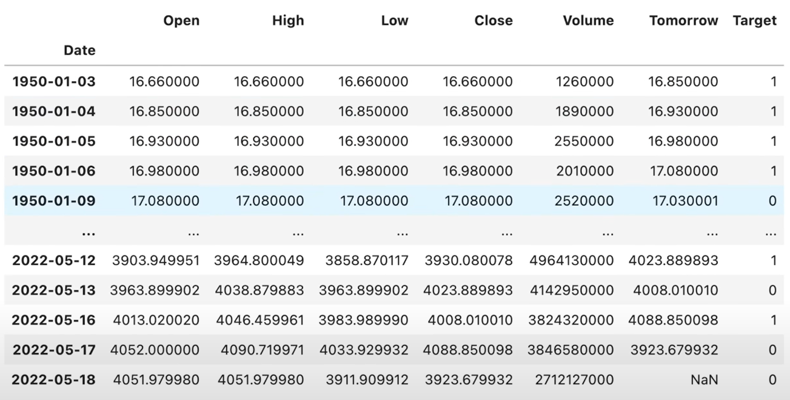

# Notes

- [Notes](#notes)
  - [Predict The Stock Market With Machine Learning And Python](#predict-the-stock-market-with-machine-learning-and-python)
    - [Downloading the data from Yahoo Finance:](#downloading-the-data-from-yahoo-finance)
    - [Cleaning and visualising the data](#cleaning-and-visualising-the-data)
    - [Defining the target of our ML prediction](#defining-the-target-of-our-ml-prediction)
    - [Removing old data that is likely to be less relevant](#removing-old-data-that-is-likely-to-be-less-relevant)
    - [Training initial model](#training-initial-model)
    - [Building a backtesting system](#building-a-backtesting-system)
    - [Adding additional predictors to our model](#adding-additional-predictors-to-our-model)
    - [Improving our model](#improving-our-model)
    - [Some things to consider to improve](#some-things-to-consider-to-improve)


## Predict The Stock Market With Machine Learning And Python

Notes from https://www.youtube.com/watch?v=1O_BenficgE

- Many real world considerations to take into account when predicting stock prices

### Downloading the data from Yahoo Finance:

```python
import yfinance as yf
sp500 = yf.download("^GSPC)
sp500=sp500.history(period="max")
```

Result is a Pandas Dataframe:


Each row a trading day - non-trading days are omitted
The columns are:

- Open: The price of the stock at the beginning of the trading day (it need not be the closing price of the previous trading day)
- High: The highest price of the stock on that trading day
- Low: The lowest price of the stock on that trading day
- Close: The price of the stock at closing time
- Volume: How many stocks were traded
- Dividends: Dividends paid by the company
- Stock Splits: If the company splits its stocks, this is the ratio

The index of the data can be found with:

```python
sp500.index
```

This shows that the data is indexed by date

### Cleaning and visualising the data

The first step is to plot the closing price of the stock:

```python
sp500.plot(y="Close", use_index=True)
```


We can now remove the columns we are ignoring for the moment for simplicity as we are looking at the whole index not individual stocks:

```python
del sp500["Dividends"]
del sp500["Stock Splits"]
```

### Defining the target of our ML prediction

We want to predict whether the price will go up or down tomorrow. We want to be able to predict this with a high degree of accuracy so our model needs
to say the market will go up on days where it does go up. We can then buy stocks knowing the market is on the up.

First we create a new column called `Tomorrow` which will be the price for market close tomorrow. We can initialise this with the shift operation
which will take the `Close` of the day before and set it as the `Tomorrow` of the day before:

```python
sp500["Tomorrow"] = sp500["Close"].shift(-1)
```

Next we create a Target which is whether todays close is higher than tomorrows close:

```python
sp500["Target"] = (sp500["Tomorrow"] > sp500["Close"]).astype(int)
```

Our data frame now looks like this:




### Removing old data that is likely to be less relevant

We can remove the data prior to 1990 as it is likely to be less relevant/reliable:

```python
sp500 = sp500.loc["1990-01-01":].copy()
```

### Training initial model

Now we have our data we can train an initial model on the data:

```python
from sklearn.ensemble import RandomForestClassifier

model = RandomForestClassifier(n_estimators=100, min_smaples_split=100, random_state=42)

train = sp500.iloc[0:-100] # All but the last 100 rows

test = sp500.iloc[-100:] # The last 100 rows

predictors = ["Close", "Open", "High", "Low", "Volume"] # columns the model may use to predict
model.fit(train[predictors], train["Target"]) # Train the model using the predictors trying to predict the target
```

Where:

- `RandomForestClassifier` is an approach that works by training a number of decision trees on random subsets of the features and then averaging the results. This is
resistant to overfitting and is a good starting point for a model as it runs fairly quickly and can pick up non-linear relationships.
- `n_estimators` is the number of trees in the forest
- `min_samples_split` is the minimum number of samples required to split an internal node - the higher this is the more resistant to overfit (at the cost of accuracy)
- `random_state` is the seed used by the random number generator and allows you to repeatably train the model

Time series data like this cannot use cross validation. This is because though it may train well it will do badly in the real world. For example if you try to predict tomoorws
stock price based on data about what it will be in 30 days you will likely do better but this is not feasible in a real world scenario. 

After running the model we can see the accuracy to see if it is working:

```python
import pandas as pd
from sklearn.metrics import precision_score # this is a good metric for this type of model as it is favouring precision

predictions = model.predict(test[predictors])

predictions = pd.Series(predictions, index=test.index) # easier to work with in this format (previous command returns a numpy array)

precision_score(test["Target"], predictions)
```

The result of this is  0.4235294117647059 which is not great. This means we only said the stock market would go up and it did 42% of the time. This is not good enough to make
any money :) we would actually be better doing the opposite of what the model says!

This is part of the process though and we can now look at improving the model.

Firstly lets plot the predictions against the actuals:

```python
combined = pd.concat([test["Target"], predictions], axis=1) # axis=1 treat each input as a column
compined.plot()
```

Orange line is the prediction and blue line is what really happened:


We can see we often predict the market will increase and it does not.

### Building a backtesting system

We are going to build a more robust way to test a model. We want to be able to test for many situations not just the last 100 days.

First we create a training function that encapsulates the training of the model:

```python
def predict(train, test, predictors, target, model):
    model.fit(train[predictors], train[target])
    predictions = model.predict(test[predictors])
    predictions = pd.Series(predictions, index=test.index, name="Predictions")
    combined = pd.concat([test["Target"], predictions], axis=1)
    return combined
```

We can then create a backtesting function:

```python
def backtest(data, model, predictors, start=2500, step=250):
  all_predictions = [] # list of dataframes
  for i in range(start, data.shape[0], step):
    train = data.iloc[0:i].copy() # all data up to test year
    test = data.iloc[i:i+step] # data of test year
    predictions = predict(train, test, predictors, model)
    all_predictions.append(predictions)
    return pd.concat(all_predictions)
```

Start is the number of days to wait before starting the backtest. In our case we have about 10 years given 250 trading days a year. 
The step is how much we jump by and represents about a year in our case. How it works is we take the first 10 years data and try to predict
year 11. Then we take the first 11 years data and try to predict year 12 and so on. This is a good way to test the model as it is not using
specific days. 

With these functions created we can then run the backtest:

```python
predictions = backtest(sp500, model, predictors)
```

We can then see how many times we predicted the market went up or down:

```python
predictions["Predictions"].value_counts()
# 0 3321
# 1 2338
```

we can also calculate the precision:
  
```python
precision_score(predictions["Target"], predictions["Predictions"])
# 0.53507...
```

So across all the training days if the market went up we predicted it went up 53.5% of the time

It would be interesting to compare this to the percentage of days it actually went up:

```python
predictions["Target"].value_counts() / predictions.shape[0]
# 1 0.536844
# 0 0.463156
```

So our model performs slightly worse than if we did just assume it went up as it did that more times!

### Adding additional predictors to our model

Firstly we will define some prediction horizxon variables:

```python
horizons = [2, 5, 60, 250, 1000]

new_predictors = []

for horizon in horizons:
  rolling_averages = sp500["Close"].rolling(horizon).mean()
  ratio_column = f"Close_ratio_{horizon}"
  sp500[ratio_column] = sp500["Close"] / rolling_averages
  trend_column = f"Close_trend_{horizon}"
  sp500[trend_column] = sp500.shift(1).rolling(horizon).sum()
  new_predictors += [ratio_column, trend_column]
```

We can consider `horizons` to be similar to a real life analyst thinking about how the stock was 2 days ago, a week  ago, 2-3 months ago, a year ago, 4 years ago
We calculate the rolling averages over those horizon periods to use to help the model predict the future better. We store these as ratios to the `Close` price
We can also calculate a Trend which is the rolling sum of the Target (i.e. our 0/1 of our predictions) over that horizon period. This will give us an idea of when
the market has been rising a lot or falling a lot over that period. 

Where there is not enough data to calculate the average or sum we will get NaN (not a number)

These rows will be removed from the data as they could cause skewing of the model:

```python
sp500 = sp500.dropna() # removes rows with NaN
```

(note this will lose the first 999 days because of the 1000 day horizon)

### Improving our model


We can now define our model and parameters to bennefit from the new predictors:

```python
model = RandomForestClassifier(n_estimators=200, min_samples_split=50, random_state=42)
```

We can also now redefine our predict function:

```python
def predict(train, test, predictors, target, model):
    model.fit(train[predictors], train[target])
    predictions = model.predict_proba(test[predictors])[:, 1] # probability of the market going up
    predictions[predictions > 0.6] = 1 # 60% chance is threshold for market going up
    predictions[predictions > 0.6] = 0 # 60% chance is threshold for market going down
    predictions = pd.Series(predictions, index=test.index, name="Predictions")
    combined = pd.concat([test["Target"], predictions], axis=1)
    return combined
```

Rather than a binary 0 or 1 this now returns a probability the stock price will go up / down which helps us be more accurate in our predictions
We are also setting a 60% threshold so the model needs to be more confident to predict the market will go up or down. 
The result will be fewer days it is predicted to go up but a higher confidence on those days

We can then run the backtest again:

```python
predictions = backtest(sp500, model, new_predictors)
```

Note we are using the ratio and trend only as the predictors as more likely to be helpful than absolute values

Looking at the results we seeL

```python
predictions["Predictions"].value_counts()
# 0 3865
# 1  796
```

So we can see there are far fewer 'going up' days and if we look at our precision score:
  
```python
precision_score(predictions["Target"], predictions["Predictions"])
# 0.5737770
```

So it is better than our previous model and better than the baseline of how many days it really goes up but still not great.

### Some things to consider to improve

- use overnight (US time) markets e.g. Japanese data to predict the next days price
- Key stocks, key sectors
- Increase resolution of the data